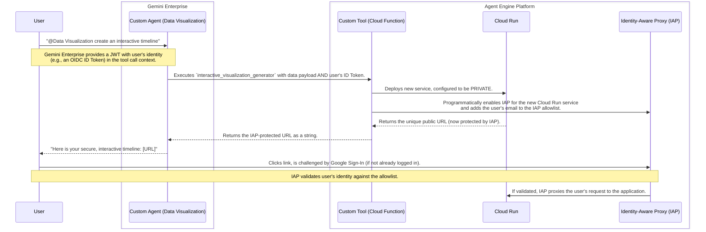

Yes, absolutely. This is an excellent and crucial point for creating a truly enterprise-grade solution.

Propagating user context from Gemini Enterprise to the final web application via OAuth2 and JWT is not only possible but is the recommended architecture for securing the system. It moves the design from "security by obscurity" to a robust, identity-aware model.

I will update the PRD to reflect this more advanced, secure architecture. The core change is to make the deployed Cloud Run service private and use **Identity-Aware Proxy (IAP)** to protect it, ensuring only the original user can access the visualization they requested.

Here is the updated PRD with the new security section.

---

# PRD: Agentic Interactive Visualization Generator

**Version:** 1.3
**Date:** 2026-03-31
**Author:** Gemini Enterprise
**Status:** Proposed

## 1. Overview

This document outlines the requirements for a **Custom Agent for Gemini Enterprise, deployable on Agent Engine**. This agent, named **"Data Visualization"**, will enable users to generate rich, interactive data visualizations on demand. The core problem is that while users want the dynamic, exploratory power of tools like NotebookLM's Mind Map and Timeline, the in-chat UI can only render static images.

This system bridges that gap. The Custom Agent will serve as the user's conversational interface within Gemini Enterprise. When invoked, it will trigger a custom tool that programmatically generates and deploys an ephemeral, **secure**, interactive web application using frameworks like Streamlit or Gradio. The final output to the user is a direct, **authenticated** URL to this live, interactive application.

## 2. Goals & Objectives

*   **Primary Goal:** To empower users to create and interact with complex visualizations from their enterprise data via a conversational command to the registered "Data Visualization" agent.
*   **Key Objectives:**
    *   Define a Custom Agent named "Data Visualization" for Agent Engine.
    *   Develop a custom tool that generates interactive charts (Plotly) within a web app (Streamlit/Gradio).
    *   **Ensure the deployed web application is secure and accessible only by the user who requested it.**
    *   The system must be cost-effective, using ephemeral, auto-decommissioned resources.

*Sections 3 & 4 (User Personas, User Stories) remain the same, with the implicit understanding that access is now secure.*

## 5. System Architecture & Secure Execution Flow

The system will propagate the user's identity from Gemini Enterprise through to the final Cloud Run application, securing the entire chain.



## 6. Functional Requirements

### 6.1. Custom Agent: `Data Visualization`

*   **Persona & Instructions:** (Remains the same as v1.2)
*   **Execution Context:** The Gemini Enterprise platform is responsible for providing an OAuth 2.0 identity token (JWT) representing the logged-in user within the execution context of any tool call.

### 6.2. Custom Tool: `interactive_visualization_generator`

*   **Tool Input:** The JSON payload is extended to include the user's identity token.

```json
{
  "auth": {
    "user_id_token": "ey..."
  },
  "viz_type": "timeline",
  "data": { ... }
}
```

*   **Tool Logic:**
    1.  **Extract User Identity:** The tool decodes the `user_id_token` JWT to securely extract the user's email address (e.g., `alex.burdenko@google.com`).
    2.  **Generate Source Code:** (No change)
    3.  **Build & Push Container:** (No change)
    4.  **Deploy Securely to Cloud Run:**
        *   Programmatically deploy the container to Cloud Run. The service MUST be configured as **PRIVATE** by setting ingress to "Internal and Cloud Load Balancing."
        *   Programmatically configure an HTTPS Load Balancer with a serverless NEG pointing to the new Cloud Run service.
        *   **Programmatically enable Identity-Aware Proxy (IAP)** on the load balancer's backend service.
        *   **Programmatically set the IAP access policy** for this service, adding the extracted user's email as the sole principal with the "IAP-secured Web App User" role.
        *   Tag the Cloud Run service and Load Balancer with a `cleanup-timestamp` label.
    5.  **Retrieve & Return URL:** The tool returns the public URL of the **Load Balancer**, which is now protected by IAP.

*Section 7 (Deployment & Registration) remains the same.*

## 8. Non-Functional Requirements

*   **Security:**
    *   **Authentication:** All deployed web applications are private and protected by Google's Identity-Aware Proxy (IAP). Only the user who initiated the request will be on the IAP allowlist for that specific instance.
    *   **Identity Propagation:** The user's identity is securely passed from Gemini Enterprise to the custom tool via a short-lived, scoped OAuth2/OIDC token (JWT).
    *   **Least Privilege:** The tool's service account requires elevated permissions to modify IAP policies and deploy Cloud Run services. These permissions must be tightly scoped.
*   **Performance:** The end-to-end deployment time may be slightly longer due to the added steps of configuring the Load Balancer and IAP. The target remains under 120 seconds.
*   **Ephemerality & Cost Control:** The `cleanup_service` is now responsible for destroying the Cloud Run service, the HTTPS Load Balancer, and its associated forwarding rules and backend configurations to prevent orphaned resources.

*Section 9 (Out of Scope) remains the same.*